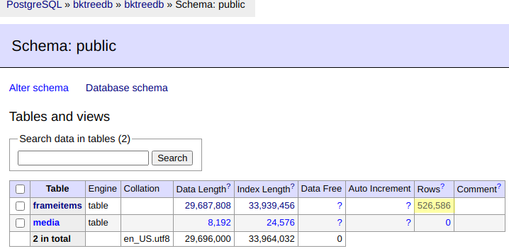

# SRT in DB


## Instructions

Structure is based on [this article](https://blog.ionelmc.ro/2014/05/25/python-packaging/#the-structure). Source code can be found in the `src` folder, and tests in the `tests` folder.

To install the package, simply execute

```bash
➤ pip install -r requirements_dev.txt
```

We use `tox` for the tests. This ensure a clear separation between the development environment and the test environment.
To launch the tests, run the `tox` command:

```bash
➤ tox
```

It first starts with a bunch of checks (`flask8` and others) and then launch the tests using python 3.

## Packaging

A Dockerfile is provided to build an image ready to be deployed, see `docker/Dockerfile`. You can build the image using `make`:

```bash
➤ make docker
```

This will create a new image named ``.

## Implementations

### PostGreSQL

#### with SqlAlchemy

Insertion d'un media et recherche d'une frame (aléatoire d'une autre source media) dans le DB:
```shell
/home/latty/.pyenv/versions/py3.8.3_pydbsrt/bin/python /home/latty/Prog/__DB_SRT__/pydbsrt/src/pydbsrt/app_with_sqlalchemy.py
2020-12-03 16:54:43,708 - INFO     - __main__      - <sqlalchemy.engine.result.ResultProxy object at 0x7f61d7f094f0>
2020-12-03 16:54:43,716 - INFO     - __main__      - media_path: /home/latty/NAS/tvshow/Silicon Valley/S02/Silicon.Valley.S02E06.Homicide.1080p.AMZN.WEB-DL.DD.5.1.H.265-SiGMA.mkv
2020-12-03 16:54:43,723 - INFO     - __main__      - Build Image Hashes from media='/home/latty/NAS/tvshow/Silicon Valley/S02/Silicon.Valley.S02E06.Homicide.1080p.AMZN.WEB-DL.DD.5.1.H.265-SiGMA.mkv'
42241it [05:01, 140.01it/s]
2020-12-03 16:59:45,429 - INFO     - __main__      - Associate frame_items(len=42241) to media(=<__main__.TMedia object at 0x7f61f0b07400>)
2020-12-03 16:59:46,140 - INFO     - __main__      - Add media to session and commit ...
2020-12-03 17:00:33,031 - INFO     - pydbsrt.tools.timer_profiling - Insert ImageHashes (from media) into db => took 349.3147 seconds
2020-12-03 17:00:33,608 - INFO     - pydbsrt.tools.timer_profiling - Build ImageHashes list (from media) => took 0.5686 seconds
2020-12-03 17:00:33,608 - INFO     - __main__      - img_hash_to_search=f52e93916c2e9391
2020-12-03 17:00:33,615 - INFO     - pydbsrt.tools.timer_profiling - Search random ImageHash (from media) into DB => took 0.0058 seconds
2020-12-03 17:00:33,615 - INFO     - __main__      - count(search_img_hash({'search_phash': -779523432693984367, 'search_distance': 0})=13
2020-12-03 17:00:33,615 - INFO     - __main__      - matched_frame_items=[FrameItem(db_id=281, p_hash=-779523432693984367, frame_offset=280, media_id=1),
 FrameItem(db_id=282, p_hash=-779523432693984367, frame_offset=281, media_id=1),
 FrameItem(db_id=283, p_hash=-779523432693984367, frame_offset=282, media_id=1),
 FrameItem(db_id=284, p_hash=-779523432693984367, frame_offset=283, media_id=1),
 FrameItem(db_id=285, p_hash=-779523432693984367, frame_offset=284, media_id=1),
 FrameItem(db_id=286, p_hash=-779523432693984367, frame_offset=285, media_id=1),
 FrameItem(db_id=287, p_hash=-779523432693984367, frame_offset=286, media_id=1),
 FrameItem(db_id=288, p_hash=-779523432693984367, frame_offset=287, media_id=1),
 FrameItem(db_id=289, p_hash=-779523432693984367, frame_offset=288, media_id=1),
 FrameItem(db_id=290, p_hash=-779523432693984367, frame_offset=289, media_id=1),
 FrameItem(db_id=291, p_hash=-779523432693984367, frame_offset=290, media_id=1),
 FrameItem(db_id=292, p_hash=-779523432693984367, frame_offset=291, media_id=1),
 FrameItem(db_id=293, p_hash=-779523432693984367, frame_offset=292, media_id=1)]
```

`Search random ImageHash (from media) into DB => took 0.0058 seconds` => ~ 6 ms pour rechercher une frame dans un ensemble de ~500k frames

C'est pas mal du tout (c'est l'ordre du raisonnable) ... à voir comment ça progresse avec l'insertion de nouveaux médias (frames).