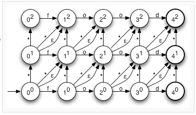

# Fast hamming distance queries in postgres

https://dba.stackexchange.com/questions/72134/fast-hamming-distance-queries-in-postgres

```
I have a large database (16M rows) containing perceptual hashes of images.

I'd like to be able to search for rows by hamming distance in a reasonable timeframe.

Currently, as far as I properly understand the issue, I think the best option here would be a custom SP-GiST implementation that implements a BK-Tree, but that seems like a lot of work, and I'm still fuzzy on the practical details of properly implementing a custom index. Calculating the hamming distance is tractable enough, and I do know C, though.

Basically, what is the appropriate approach here? I need to be able to query for matches within a certain edit-distance of a hash. As I understand it, Levenshtein distance with strings of equal length is functionally hamming distance, so there is at least some existing support for what I want, though no clear way to create an index from it (remember, the value I'm querying for changes. I cannot pre-compute the distance from a fixed value, since that would only be useful for that one value).

The hashes are currently stored as a 64-char string containing the binary ASCII encoding of the hash (e.g. "10010101..."), but I can convert them to int64 easily enough. The real issue is I need to be able to query relatively fast.

It seems like it could be possible to achieve something along the lines of what I want with the pg_trgm, but I'm a bit unclear on how the trigram matching mechamism works (in particular, what does the similarity metric it returns actually represent? It looks kind of like edit-distance).

Insert performance is not critical (it's very computationally expensive to calculate the hashes for each row), so I primarily care about searching.
```

=> une tuerie ce post !

# Implémentation du cBKTree en Python/Cython/C++

```
Well, I spent a while looking at writing a custom postgres C extension, and wound up just writting a Cython database wrapper that maintains a BK-tree structure in memory.

Basically, it maintains a in-memory copy of the phash values from the database, and all updates to the database are replayed into the BK-tree.

It's all up on github here. It also has a LOT of unit-tests.

Querying across a dataset of 10 million hash values for items with a distance of 4 results in touching ~0.25%-0.5% of the values in the tree, and takes ~100 ms.
```

- https://github.com/fake-name/IntraArchiveDeduplicator/tree/master/deduplicator
- https://github.com/fake-name/IntraArchiveDeduplicator/blob/master/deduplicator/cyHamDb.pyx
=> très intéressant, regarder/étudier l'implémentation en cython/C++
  
# Implémentation en PostgreSQL + SP-GIST

```
Ok, I've finally taken the time to write a custom PostgreSQL indexing extension. I used the SP-GiST interface.

This was fairly challenging, mostly because Posgres is big.

Performance-wise, it's currently ~2-3 times slower then the pure-in-memory implementation in my other answer to this question, but it's so much more convenient to use I'll happily eat that performance hit (realistically, it's ~50 ms/query - 150 ms/query, which is still pretty small).
```

- https://github.com/fake-name/pg-spgist_hamming
- README: https://github.com/fake-name/pg-spgist_hamming/blob/master/README.md

## PostgreSQL: SP-GIST extension


https://www.postgresql.org/docs/current/spgist.html

## Tests

https://github.com/fake-name/IntraArchiveDeduplicator/tree/master/Tests

## Question autour de la performance

https://github.com/fake-name/pg-spgist_hamming/issues/1


# Theory

## Triangle inequality

https://en.wikipedia.org/wiki/Triangle_inequality


## Levenshtein distance

https://en.wikipedia.org/wiki/Levenshtein_distance


## Damn Cool Algorithms, Part 1: BK-Trees (2007)

http://blog.notdot.net/2007/4/Damn-Cool-Algorithms-Part-1-BK-Trees

### Damn Cool Algorithms: Levenshtein Automata

http://blog.notdot.net/2010/07/Damn-Cool-Algorithms-Levenshtein-Automata



=> ca a l'air intéressant, mais plus chaud en théorie ...

## The BK-Tree – A Data Structure for Spell Checking (2013)

https://nullwords.wordpress.com/2013/03/13/the-bk-tree-a-data-structure-for-spell-checking/


## Some Approaches to Best-Match File Searching (1973)

http://citeseerx.ist.psu.edu/viewdoc/download?doi=10.1.1.160.2510&rep=rep1&type=pdf


## VP-Tree
### Python VP-tree implementation


- http://www.logarithmic.net/pfh/blog/01164790008
- https://www.logarithmic.net/pfh-files/blog/01164790008/VP_tree.py

### Building an Image Hashing Search Engine with VP-Trees and OpenCV (2019)
https://www.pyimagesearch.com/2019/08/26/building-an-image-hashing-search-engine-with-vp-trees-and-opencv/


=> super intéressant, à lire/étudier, et s'inspirer :p

#### RickardSjogren / vptree (2020)

https://github.com/RickardSjogren/vptree


